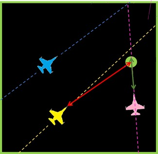
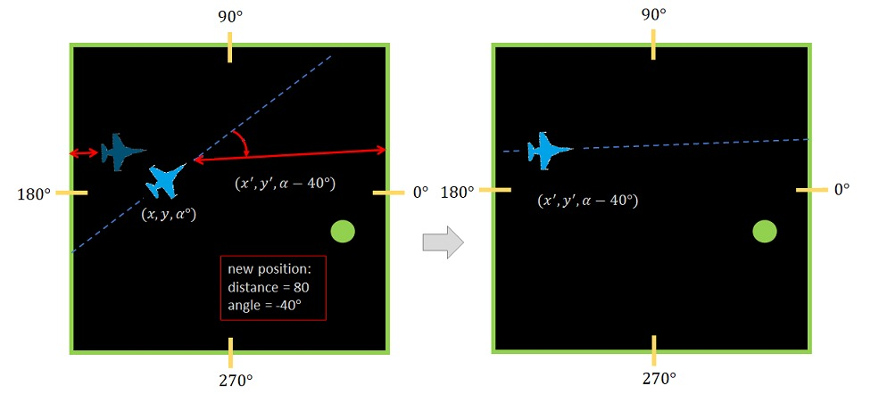

# DroneGameASM

This game was written for Computer Architecture and system programming course. (Assignment 3)

Game was written fully in NASM and was not mandatory.

Game logic heavily relies on Co-routines.

-----

Info -

This is a multi-drones single-target game, the game has 100x100 game board on which a group of N drones hunts the same target from different points of view and from different distances. Each drone tries to detect where is the target on the game board, in order to destroy it. Drones may destroy the target only if the target is no more than some given distance, d, from the drone. When the current target is destroyed, some new target appears on the game board in some randomly chosen place. Every T rounds the target randomly changes its position. Every R rounds two (or one in case there are only two drones left) of the drones are "eliminated" (in a manner which is described below), the last drone left in the game is the winner of the game.

Each drone has a two-dimensional position on the game board: (coordinate x, coordinate y), and direction (angle from x-axis)*, two drones may occupy the same position. Moreover, each drone has a constant speed which is randomly picked at the start (drone initialization). All the above state variables are represented by floating-point numbers. Drones move according to their speed using their current heading, from their current place. They then randomly change their heading, as described below, before the next move. After each movement, a drone calls the mayDestroy(…) function with its new position on the board. The mayDestroy(…) function returns TRUE if the caller drone may destroy the target, otherwise returns FALSE. If the current target is destroyed, a new target is created at a random position on the game board. Note that drones do not know the coordinates of the target on the board game. In the example below, the blue and the yellow drones are very far from the target and cannot destroy it, and the pink drone is close enough to it. The pink drone can destroy the target.

To read more:
https://www.cs.bgu.ac.il/~caspl212/Assignments/Assignment_3

Illustration:
------

------

* Do note that this program has no GUI and the illustration is only here to showcase how the game is played.
